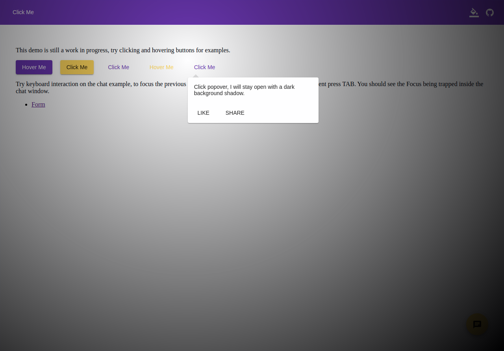

#### Bug, feature request, or proposal:
Feature Request: dark overlay shadow to put the binding element and the popover in focus.

#### What is the expected behaviour?
When the popover overlay is attached, the binding element should be in focus and rest of the page will be blurred.

#### What is the current behaviour?
The popover when opens have a transparent backdrop, and if the arrowColor is white, it becomes hard to sometime understand which element it is binding to. 

#### What are the steps to reproduce?

Provide a working example using StackBlitz (or similar) to reproduce the problem.
StackBlitz Template: https://stackblitz.com/fork/mde-popover

#### What is the use-case or motivation for changing an existing behaviour?
Extending the behavior of popover to include an option to specify a dark overlay.

#### Which versions of Angular, Material-Extended, OS, TypeScript, browsers are affected?
Material-Extended: 2.3.1,
Anular 6+

#### Other Comments
